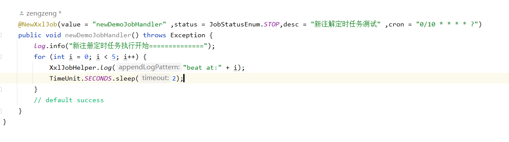

# xxl-job

#### 介绍
xxl-job 这个定时任务框架还是非常nice的, 项目中也使用的比较多
基于xxl-job 小改动, 原有项目注解@XxlJob没有删除, 启动后需手动去admin创建任务,  新增了@NewXxlJob注解 ,实现自动创建执行器 与定时任务

#### 软件架构
软件架构说明

#### 安装教程

1.  基于springboot 直接使用, 只需要导购xxl-job-core包
2.  新增starter  自动配置

#### 使用说明

#### 参与贡献

1.  Fork 本仓库
2.  新建 Feat_xxx 分支
3.  提交代码
4.  新建 Pull Request

#### 特技

1.  使用 Readme\_XXX.md 来支持不同的语言，例如 Readme\_en.md, Readme\_zh.md
2.  Gitee 官方博客 [blog.gitee.com](https://blog.gitee.com)
3.  你可以 [https://gitee.com/explore](https://gitee.com/explore) 这个地址来了解 Gitee 上的优秀开源项目
4.  [GVP](https://gitee.com/gvp) 全称是 Gitee 最有价值开源项目，是综合评定出的优秀开源项目
5.  Gitee 官方提供的使用手册 [https://gitee.com/help](https://gitee.com/help)
6.  Gitee 封面人物是一档用来展示 Gitee 会员风采的栏目 [https://gitee.com/gitee-stars/](https://gitee.com/gitee-stars/)
